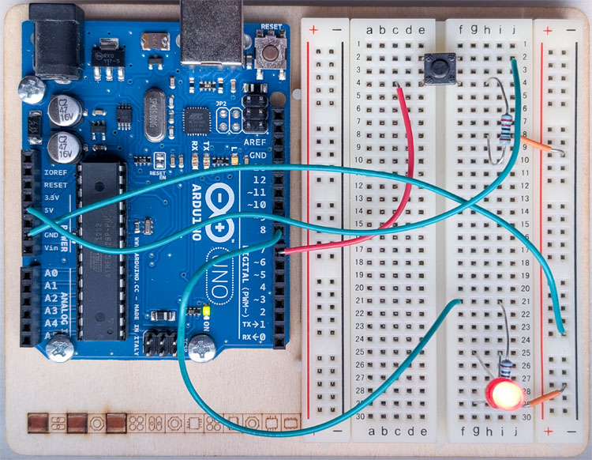

# Programming Arduino's AVR Microcontroller in C

A friend got this school assignment, and since I was out of hobby
projects, I thought it would be fun to give it a go:

> _Write a C program for an AVR microcontroller that uses UART (Universal
> Asynchronous Receiver-Transmitter) to: (i) send a message "Button
> Pressed!" when a button connected to a digital pin is pressed and (ii)
> receive a command ("ON" or "OFF") from the serial terminal to turn an
> LED on or off._

My Arduino Uno Rev 3 happens to have both an AVR and a UART, and
writing such a program using the friendly Arduino C libraries would be
quite easy. The task, however, is to use generic AVR libraries, which
are much more low-level. Great fun!

## Setup

### Download and install

* [GCC Compilers for
  AVR](https://www.microchip.com/en-us/tools-resources/develop/microchip-studio/gcc-compilers)
  for compiling the program
* [AVRDUDE](https://github.com/avrdudes/avrdude) for transferring the
  program to the AVR microcontroller
* [Arduino IDE](https://www.arduino.cc/en/software/) (optional) for
  simple access to duplex serial communication using the "Serial
  Monitor" pane

### Arduino Setup

The Arduino is set up as outlined in the [Arduino – Turn LED ON and
OFF With
Button](https://roboticsbackend.com/arduino-turn-led-on-and-off-with-button/)
exercise. I tested the wiring using [a simple
program](test-arduino-wiring.c) written in the higher-level C of
Arduino IDE, and I'm glad I did, because my initial wiring was
wrong. I'm a programmer; I don't know anything about electronics. :-)

(I found mostly green wires in my kit, hence the unconventional coloring.)

## Relevant Documentation

* [AVR Atmega328P UART](http://www.rjhcoding.com/avrc-uart.php)
* [A000066-full-pinout.pdf](https://docs.arduino.cc/resources/pinouts/A000066-full-pinout.pdf)
* [AVR 8-Bit Microcontroller](https://ww1.microchip.com/downloads/en/DeviceDoc/en590320.pdf)

## Implementation Notes

[This implementation](program.c) uses a naive approach with an active
waiting loop, continuously polling for data from the USART and the
button. This is not energy efficient. A real-life implementation would
register interrupt handlers for the two input sources and spend most
of the time sleeping.

## Building and Transferring the Program

I did this using Terminal on my Mac. It will be quite similar for
Linux. If you are on Windows, you are on your own.

### Identifying the Device

We need to figure out the device name of the Arduino. The simplest
approach may be to:

1. Unplug the Arduino
1. `ls /dev/cu.*`
1. Plug the Arduino in
1. Again `ls /dev/cu.*`

There should be one new device file after plugging in the Arduino,
this is the device file to use. The last time I ran it, the Arduino
was `/dev/cu.usbmodem101`.

(An even simpler approach is to start Arduino IDE and press the device
drop-down to see how it is identified.)

### Editing the Build Script

Edit `build.sh` and change the `DEVICE` variable to reflect what you
found above.

Also change the `PATH` variable to point to wherever you installed the
GCC Compilers for AVR and AVRDUDE.

### Building

Just type `./build.sh` to build the program ([program.c](program.c))
and transfer it to the Arduino.

If you get device-related errors during the transfer, make sure your
Arduino IDE is not running. Only one process at a time gets access to
the device.

## Testing

Although you may test using any program capable of sending and
receiving over a serial interface, I found it easier to just use the
built-in "Serial Monitor" of Arduino IDE. You enable it by pressing
the magnifying glass in the upper right corner of the IDE.

The Serial Monitor will print any text sent from the microcontroller
and also let you send lines of text. This is where you type "ON" or
"OFF" to control the LED.
